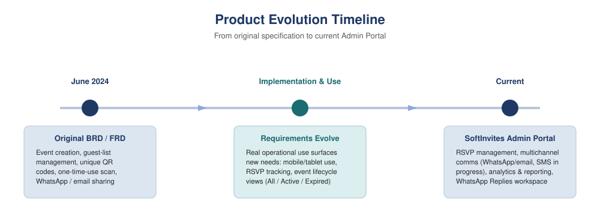
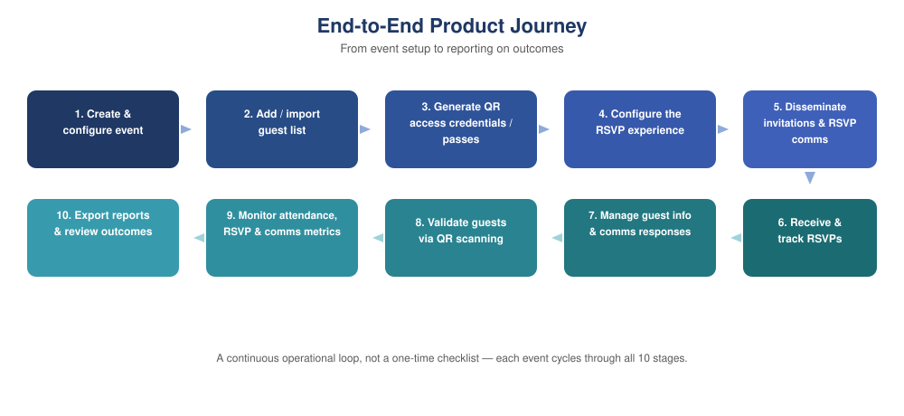

# SoftInvites: Evolving an Event Guest Management Platform

**Role:** Product Owner / Business Analyst
**Focus:** Requirements definition, functional specification, product evolution
**Artifacts:** BRD, FRD, requirements-to-feature tracking, product evolution mapping

---

## Overview

I worked on SoftInvites as an event and guest management product, translating operational requirements into a digital workflow for managing events, guests, invitations, RSVP and venue check-in.

The product started with a requirements specification focused on event creation, guest-list management and unique QR-based access. The original functional specification also covered one-time codes, QR scanning, invitation sharing, security, reporting and responsive access across devices.

As the product moved into implementation and operational use, the requirements evolved. The system became an internal Admin Portal, the interface was made usable across mobile and tablet devices, and the event workflow developed into All, Active and Expired event views. RSVP became a significant part of the product, allowing event teams to generate RSVP links, request attendance confirmation, track responses and manage communications.

The communication workflow also expanded. WhatsApp and email are currently available, while SMS is in progress. The current portal brings guest management, RSVP administration, communication, check-in and reporting into a more integrated operational workflow.

## The Product Management Lesson

Requirements do not stop at the point where a BRD or FRD is written. Real users and operational conditions reveal new requirements, clarify existing ones, and change priorities. SoftInvites gave me practical experience of taking a business need through requirements, functional specification, implementation, iteration and operational use.

## How the Product Evolved

| Area | Original Position | Current / Evolved Position |
|---|---|---|
| Access model | Broader registration and creator-facing functionality specified | Used internally through administrator login |
| Device accessibility | Web and mobile-responsive requirements specified | Fully accessible on mobile and tablet in operational use |
| RSVP | Not represented as a workflow in the original FRD | Central workflow: RSVP links, tracking, attendance responses |
| Communication | WhatsApp and email sharing specified | WhatsApp and email live; SMS in progress |
| Analytics | Scan analysis and admin reporting specified | Full event, guest, check-in, RSVP and communication analytics |

*See the full requirements-to-product mapping in the complete BRD/FRD document.*

## Evidence

- Anonymised product overview / system map
- RSVP workflow diagram
- Event-to-check-in process flow
- Product evolution timeline
- [Full anonymised BRD/FRD (PDF)](brd-frd.pdf)

---

[← Back to home](../../)
